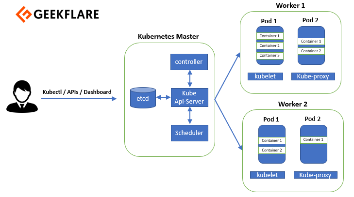

# kubernetes

Kubernetes from 💩 zero to 👻 hero.

## Installation

- [Install and Set Up kubectl](https://kubernetes.io/docs/tasks/tools/install-kubectl/#install-kubectl-on-linux)
- [Install Minikube](https://kubernetes.io/docs/tasks/tools/install-minikube/)

## Documents

- [Giới thiệu về Kubernetes, khái niệm cơ bản và thực hành ngay trên trình duyệt Web](https://medium.com/vinid/gi%E1%BB%9Bi-thi%E1%BB%87u-v%E1%BB%81-kubernetes-kh%C3%A1i-ni%E1%BB%87m-c%C6%A1-b%E1%BA%A3n-v%C3%A0-th%E1%BB%B1c-h%C3%A0nh-ngay-tr%C3%AAn-tr%C3%ACnh-duy%E1%BB%87t-web-8fbea30053e7)
- [Understanding Kubernetes Architecture](https://geekflare.com/kubernetes-architecture/)
- [book Kubernetes CheatSheets In A4](https://github.com/dennyzhang/cheatsheet-kubernetes-A4)
- [Kubernetes vs Docker Swarm — A Comprehensive Comparison](https://hackernoon.com/kubernetes-vs-docker-swarm-a-comprehensive-comparison-73058543771e)
- [Awesome-Kubernetes](https://github.com/ramitsurana/awesome-kubernetes)
- [How to set up a serious Kubernetes terminal](https://www.freecodecamp.org/news/how-to-set-up-a-serious-kubernetes-terminal-dd07cab51cd4/)
- [Hands-on guide: developing and deploying Node.js apps in Kubernetes](https://learnk8s.io/nodejs-kubernetes-guide)
- [React, Express, Node Js, and MongoDB (MERN Stack) microservices-based application deployment on Kubernetes](https://itnext.io/react-express-node-js-and-mongodb-mern-stack-microservices-based-application-deployment-on-ec4607cec74d)
- [kompose user guide](https://github.com/kubernetes/kompose/blob/master/docs/user-guide.md)
- [Set up Ingress on Minikube with the NGINX Ingress Controller](https://kubernetes.cn/docs/tasks/access-application-cluster/ingress-minikube/)
- [Horizontal Pod Autoscaler Walkthrough](https://kubernetes.io/docs/tasks/run-application/horizontal-pod-autoscale-walkthrough/#create-horizontal-pod-autoscaler)
- [Kubernetes Networking Guide for Beginners](https://matthewpalmer.net/kubernetes-app-developer/articles/kubernetes-networking-guide-beginners.html)
- [Example: Deploying WordPress and MySQL with Persistent Volumes](https://kubernetes.io/docs/tutorials/stateful-application/mysql-wordpress-persistent-volume/)
- [Storing data into Persistent Volumes on Kubernetes](https://medium.com/@xcoulon/storing-data-into-persistent-volumes-on-kubernetes-fb155da16666)
- [Tutorial – Kubernetes Persistent Volumes](https://portworx.com/tutorial-kubernetes-persistent-volumes/)
- [Deploying a multi-container application to Azure Kubernetes Services](https://azuredevopslabs.com/labs/vstsextend/kubernetes/)
- [DNS for Services and Pods](https://kubernetes.io/docs/concepts/services-networking/dns-pod-service/)
